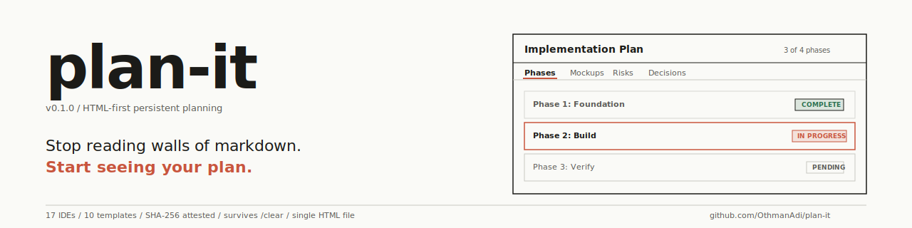
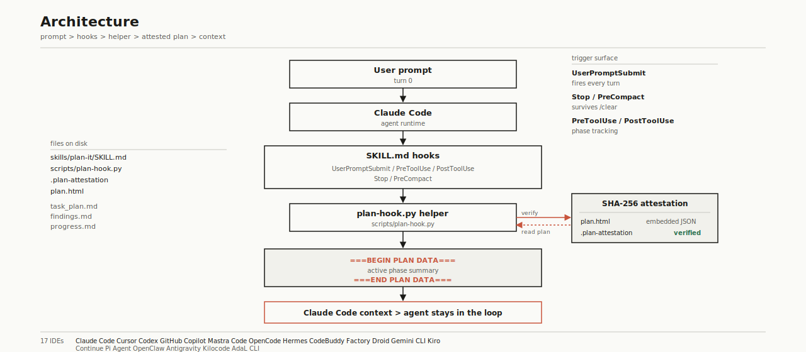
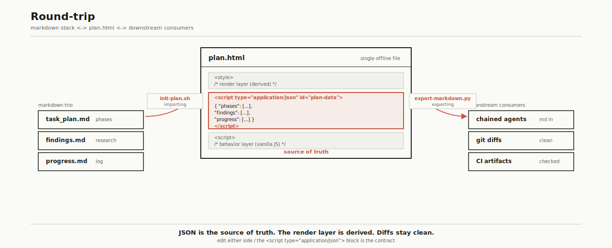

<div align="center">

</div>

# plan-it

> **Stop reading walls of markdown. Start *seeing* your plan.**
> The first HTML-first planning skill for Claude Code, Cursor, and 15 other agents. One file. Survives `/clear`. SHA-256 attested. Built in the publication window of Thariq Shihipar's "HTML is the new markdown."

```
npx skills add OthmanAdi/plan-it
```

[](https://github.com/OthmanAdi/plan-it/releases)
[](tests/)
[](https://opensource.org/licenses/MIT)
[](https://code.claude.com/docs/en/plugins)
[](#supported-platforms-17)
[](https://claude.com/blog/using-claude-code-the-unreasonable-effectiveness-of-html)

## The pitch

Markdown plans don't get read.

You write a phase breakdown. You drop a hundred bullets. The agent skims. You skim. By phase 3 nobody knows what was decided in phase 1. By phase 5 the plan is a wall of text nobody opens.

plan-it gives you a single `plan.html` instead. Tabs. Drag-cards. Sliders. Mockups. Copy-as-markdown when you need it back as text. Embedded JSON as the canonical state. Open it in your browser. Drag a card. Watch a checkbox. Read it like a dashboard, not a thread.

It survives `/clear` because the file lives on disk and the hooks re-inject the active phase on every prompt. It's tamper-protected by SHA-256. It ships across 17 IDEs day 1.

```
/plan implementation-plan
/plan-render
```

Two commands. You're in.

## What you get

10 ready-to-use HTML templates across all 9 categories Thariq named in [the gallery](https://thariqs.github.io/html-effectiveness):

| Template | What it does |
|---|---|
| **implementation-plan** | Phases + mockups + data-flow diagram + risk table |
| **three-approaches** | Side-by-side approach comparison with pros/cons/effort meters |
| **ticket-triage** | Drag-and-drop Now/Next/Later/Cut board with markdown export |
| **feature-flag-editor** | Grouped toggles + dependency warnings + diff-copy |
| **module-map** | Inline SVG architecture diagram with pan/zoom |
| **annotated-pr** | Unified diff with margin annotations + severity tags |
| **living-design-system** | Color/type/spacing/component variants, click to copy CSS var |
| **animation-sandbox** | Sliders for duration + easing, copy-as-CSS button |
| **weekly-status** | Shipping/Slipping/Blocked + sparkline of slip days |
| **incident-timeline** | Minute-by-minute post-mortem with log excerpts + action items |

Plus a CLI to bring them up: `/plan`, `/plan-render`, `/plan-attest`, `/plan-status`, `/plan-export markdown`, `/plan-goal`, `/plan-loop`.

## Why HTML, not markdown

[Thariq Shihipar called it](https://claude.com/blog/using-claude-code-the-unreasonable-effectiveness-of-html) on 2026-05-08:

> "The format the agent emits is the control surface the human inspects, not a wrapper around it."

With Opus 4.7 at 1M tokens, the cost argument for markdown is dead. The constraint that's left is engagement. A plan only matters if it gets read. HTML preserves spatial layout, interactivity, comparisons, mockups — all the things markdown linearizes away.

plan-it is the persistent skill for that thesis. Web-artifacts-builder makes one-shot artifacts. Playground makes throwaway tools. Frontend-design produces components. None of them survive `/clear`. None mirror to 17 IDEs. None ship SHA-256 attestation. plan-it does all three.

## What plan-it ships

| Capability | plan-it |
|---|:---:|
| Persistent across `/clear` | yes |
| Multi-IDE adapters | 17 |
| SHA-256 tamper attestation | yes |
| Lifecycle hooks | 5 |
| HTML output | yes |
| Planning-specific templates | 10 |
| Single-file offline (no CDN) | yes |
| Bidirectional Markdown export | yes |
| Parity-locked version bumper across IDE mirrors | yes |
| Pytest coverage | 120 green |

## The thesis we ship on

> "HTML is the new markdown. I've stopped writing markdown files for almost everything and switched to using Claude Code to generate HTML for me."  
> — [Thariq Shihipar](https://x.com/trq212/status/2052811606032269638), Anthropic engineer

plan-it is the persistent, multi-IDE planning skill for the era that line opened.

## Install

### Claude Code plugin marketplace
```
/plugin marketplace add OthmanAdi/plan-it
/plugin install plan-it@plan-it
```

### Any agent-skills-compliant IDE
```
npx skills add OthmanAdi/plan-it
```

### Manual
```
git clone https://github.com/OthmanAdi/plan-it
ln -s "$PWD/plan-it/skills/plan-it" ~/.claude/skills/plan-it
```

## Supported platforms (17)

**Hooks lifecycle enabled** (auto re-inject on every prompt, session catchup, SHA-256 attestation, PreCompact flush):
Claude Code · Cursor · Codex · GitHub Copilot · Mastra Code · OpenCode · Hermes · CodeBuddy · Factory Droid · Gemini CLI · Kiro

**Standard agent-skills support**:
Continue · Pi Agent · OpenClaw · Antigravity · Kilocode · AdaL CLI

17 byte-identical script + template mirrors. English-only for v0.1.0; localized SKILL.md variants land in v0.2.0 with real translations.

## Quick demo

```bash
git clone https://github.com/OthmanAdi/plan-it && cd plan-it
bash scripts/init-plan.sh implementation-plan
bash scripts/render-plan.sh
```

The browser opens. The plan is live. Drag a card. Toggle a checkbox. Click **Copy as Markdown**. Paste it anywhere.

Want it locked? `bash scripts/attest-plan.sh`. Now any byte change to `plan.html` blocks hook injection until you re-attest. Trust boundary on disk.

Want it back as text? `python scripts/export-markdown.py`. You get `task_plan.md`, `findings.md`, `progress.md` — exact same shape as planning-with-files. Hand-edit anywhere.

## Architecture

<div align="center">

</div>

In 80 characters:

```
plan.html = <style> + <script type=application/json id=plan-data> + <script>
```

JSON is the source of truth. The render layer is derived. Diffs are clean. The agent reads the JSON. The human sees the dashboard.

Hooks re-inject the active phase on every prompt with `===BEGIN PLAN DATA===` markers (never `---`, because that breaks Claude Code's skill loader — [carried lesson from planning-with-files v2.38.1](https://github.com/OthmanAdi/planning-with-files/releases/tag/v2.38.1)).

## Round-trip with markdown

<div align="center">

</div>

For chained agents, git-committed specs, or anyone who wants source text back, `/plan-export markdown` flattens the JSON into a planning-with-files compatible trio (`task_plan.md` + `findings.md` + `progress.md`). The HTML stays canonical; the markdown is a derived view. Edit either side, the JSON is the contract.

## Token-cost honesty

HTML uses about 2-3x the tokens of markdown for the same plan. On Opus 4.7's 1M context that's nothing. For chained agents or git-committed specs, run `/plan-export markdown` — the JSON round-trips clean to three planning-with-files-compatible files.

## Built on the shoulders of

- **planning-with-files** ([OthmanAdi](https://github.com/OthmanAdi/planning-with-files), 21,681 stars) — the markdown predecessor. Hook lifecycle, session catchup, SHA-256 attestation, parity-locked bumper, 17-IDE distribution all carry over to plan-it.

## Status

- **v0.1.1** (2026-05-22). Save button, idempotent re-render, sanitizer for agent-side injection, and issue #3 fix (literal `</script>` substring in a JS comment was killing tab rendering). 207/207 pytest tests green. 16-file parity-locked. Sync-verify clean.
- **v0.1.0** (2026-05-20). First cut. 120/120 pytest tests green.
- Roadmap: real localizations (ar/de/es/zh/zht), MDX output mode, team mode, here.now publish integration.

## License

MIT. See [LICENSE](LICENSE).

Built by [Ahmad Othman Ammar Adi](https://github.com/OthmanAdi). One squashed commit per release. Sachlich tone. No em-dashes. Run prose through [/humanizer](https://github.com/blader/humanizer) before posting.
